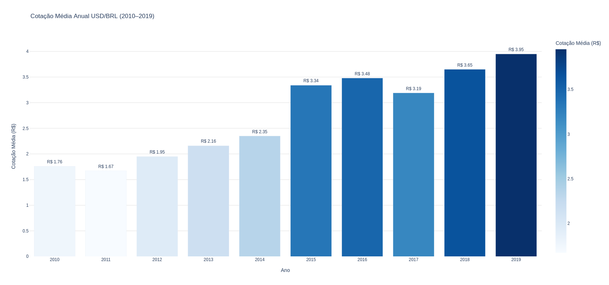

# Projeto — Visualização da Informação

**Nome:** Richardt Justke
**RGM:** 47760524
**Instituição:** Cruzeiro do Sul
**Curso:** Ciência da Computação

**Link do dataset utilizado:**
https://github.com/RichardtJustke/projectVI/blob/main/USD_BRL_hist.csv
**Link do vídeo de apresentação:** https://youtu.be/-lkE5C9QA7Y

---

## Como executar

```bash
# Instalar dependências
pip install pandas plotly

# Rodar o projeto
python main.py
```

> Os gráficos abrem automaticamente no navegador, um por vez.

---

## Gráficos

### 1. Histórico Diário da Cotação USD/BRL (2010–2019)

**Técnica utilizada:** Gráfico de Linhas
**Unidade:** Visualização de Informação Temporal

Este gráfico exibe a evolução contínua da cotação diária do dólar ao longo de uma
década. A abordagem de linha é ideal para séries temporais contínuas, permitindo
identificar tendências, picos e vales ao longo do tempo — como a forte
desvalorização do real observada entre 2014 e 2016.

.png)

---

### 2. Cotação Média Anual USD/BRL (2010–2019)

**Técnica utilizada:** Gráfico de Barras
**Unidade:** Visualização com Gráficos da Estatística Descritiva

Utiliza a agregação dos dados para apresentar a média aritmética do câmbio a cada
ano de forma discreta. Permite uma comparação visual direta do comportamento
central da moeda por período, evidenciando o crescimento consistente da cotação
ao longo da década.



---

### 3. Cotação Média por Ano e Trimestre

**Técnica utilizada:** Treemap
**Unidade:** Visualização de Informação Hierárquica

Trata a dimensão do tempo de forma aninhada — anos como nível superior e
trimestres como subnível. O tamanho e a cor de cada bloco são proporcionais à
cotação média do período, evidenciando visualmente a distribuição e a relevância
de cada subconjunto de dados. O gráfico é interativo: clicando em um ano é
possível explorar seus trimestres individualmente.

.png)
